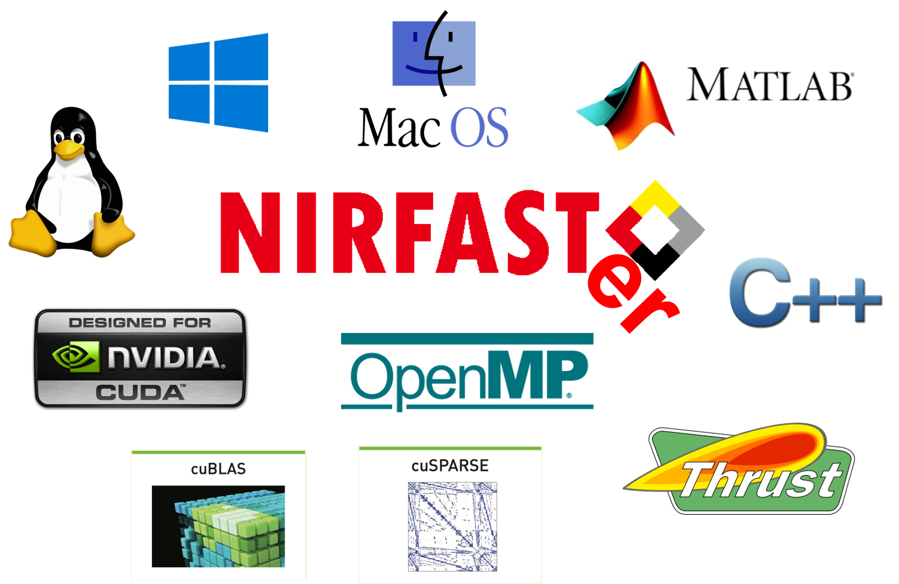

#  NIRFASTer
Open source software for multi-modal optical molecular imaging

## MATLAB Compatibility
May not work on MATLAB versions earlier than R2016b.

## CUDA Compatibility
- Compute Capability >= 3.0.
  > As a rule of thumb, this is true for Nvidia's GPUs released on 2012 (Kepler) and onwards.
- Nvidia Driver version >= 418.39.
  > Make sure you use the newest Nvidia drivers. The GPU code was compiled with the CUDA Toolkit 10.1. Thus, drivers >=418.39 should work fine.

## INSTALL
Set MATLAB path (with subfolders) to the NIRFASTer folder.

## VERIFY INSTALL
Run the `isCUDA` function on MATLAB command window.

Show help for this function running `help isCUDA` from the command window.

Run `nirfasterroot` from the command window.

## Where to start
Run the *test_\*.mlx* MATLAB Live Code examples to learn how to use the supported modalities.

Read functions help.

## License
See the *LICENSE.txt* file for details.

## General architecture

